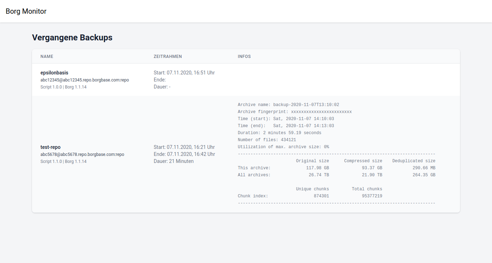

# BORG MONITOR

Borg monitor is a web application listing a history of [BorgBackup](https://www.borgbackup.org/) runs.  
Frontend is powered by [Next.js](https://nextjs.org/r), [React](https://reactjs.org/), [react-query](https://react-query.tanstack.com/) and [Tailwind CSS](https://tailwindcss.com/).
Backend is powered by [Strapi](https://strapi.io/).  

## Why

For my own servers and several customers I implemented a backup script using Borg and [BorgBase](https://www.borgbase.com/).  
While I see connections and date and time of the latest successful backup in BorgBase, I don't know anything about started backups and if started backups do really finish.  
This is especially relevant for customers, where I don't have access to the actual log file.

## How it works

With Borg Monitor, my backup script makes a `POST` request before and after every backup run, also transmitting the last few lines of the log file containing the summary provided by the `--stats` parameter.  
The metadata of each run is saved in the backend and listed by the frontend.

## So where's the script

My backup solution contains of 5 files which are provided by the frontend for download on client computers.  
The `variables.txt` has to be changed with the actual configuration.  
The `exclude-repo-name.txt` and `patterns-repo-name` have to be renamed and should be adapted for your needs.  

- [backup.sh](https://backup.f-bit.software/backup.sh)
- [variables.txt](https://backup.f-bit.software/variables.txt)
- [patterns-repo-name.lst](https://backup.f-bit.software/patterns-repo-name.lst)
- [exclude-repo-name.txt](https://backup.f-bit.software/exclude-repo-name.txt)

## LICENSE
MIT

## Author

Made with ❤️ by Frédéric Bolvin, f-bit software.